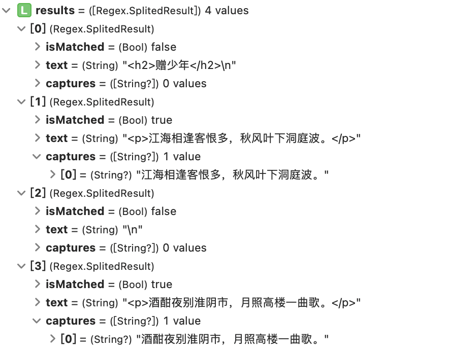

## Requirements

* iOS 10.0+
* Swift 5.1+


## Installation

### Cocoapods

To integrate YLRegex into your Xcode project using CocoaPods, specify it in your `Podfile`:

```ruby
source 'https://github.com/CocoaPods/Specs.git'
platform :ios, '10.0'
use_frameworks!

target 'MyApp' do
  # your other pod
  # ...
  pod 'YLRegex'
end
```

Run `pod install` to build your dependencies.


## Usage

```swift
let text = """
<h2>赠少年</h2>
<p>江海相逢客恨多，秋风叶下洞庭波。</p>
<p>酒酣夜别淮阴市，月照高楼一曲歌。</p>
"""
```

firstMatch

```swift
if let result = text.firstMatch(pattern: #"<h(\d+)>(.*?)</h\1>"#) {
    print(result.matchedString) // <h2>赠少年</h2>
    print(result.captures)      // [Optional("2"), Optional("赠少年")]
}
```

allMatches

```swift
let matches = text.allMatches(pattern: "<p>(.*?)</p>")
for match in matches {
    print(match.captures)
}
// [Optional("江海相逢客恨多，秋风叶下洞庭波。")]
// [Optional("酒酣夜别淮阴市，月照高楼一曲歌。")]
```

match

```swift
print("hello, world!".match(pattern: #"\w+, "#))	// true
```

split

```swift
let results = text.split(usingRegex: "<p>(.*?)</p>")
print(results)
```



replacingAll

```swift
// 1
let string = "hello, world"
print(string.replacingAll(matching: #"(\w+)(.+?)(\w+)"#, with: "$3$2$1"))
// world, hello

// 2
let result = "<h2>hello</h2>".replacingAll(matching: #"<h(\d+)>(.*?)</h\1>"#) { (result) -> String in
    let level = result.captures[0].flatMap(Int.init)!
    return "<h\(level * 2)>\(result.captures[1]!)</h\(level * 2)>"
}
print(result)  // <h4>hello</h4>
```

replacingFields

```swift
let string = "132 172"
print(string.replacingFields(with: ["1": "<", "2": ">"]))
// <3> <7>
```

将邮箱保护字段替换为解码后的字段

```swift
let text = #"请发送邮件到：<a href="/cdn-cgi/l/email-protection" class="__cf_email__" data-cfemail="30515253705152531e535f5d">[email&#160;protected]</a>"#
print(text.decodingProtectedFields())
// 请发送邮件到：abc@abc.com
```


## License

YLRegex is released under the MIT license. See LICENSE for details.

